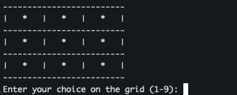
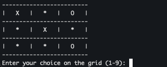
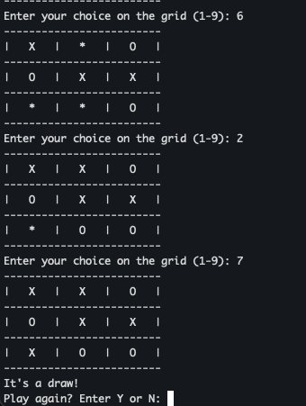

# Tic-Tac-Toe

## Info

This is a terminal game that uses hand-crafted AI to predict the next move for the computer. 

## Executing program
`python3 tic_tac_toe.py`

## How to play

Once launched, a board will be displayed with '*' in all nine boxes. The user will be prompted 
to enter a number between 1-9, corresponding with the appropriate box. Select boxes in an attempt to get 
three in a row either vertically, horizontally, or diagonally. 

## Hand-crafted AI info

The hand-crafted AI uses a modified version of a backtracking algorithm to determine the best choice for each
turn. It first checks if there are any winning moves on the board, then if there are any win-preventing moves on the board,
if neither of those are available, it checks if there is a box available next to an already placed choice. If it is the first move 
for the computer, it randomly selects a box. 

